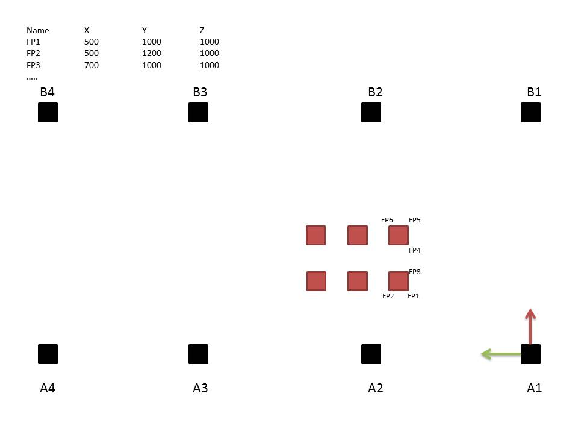
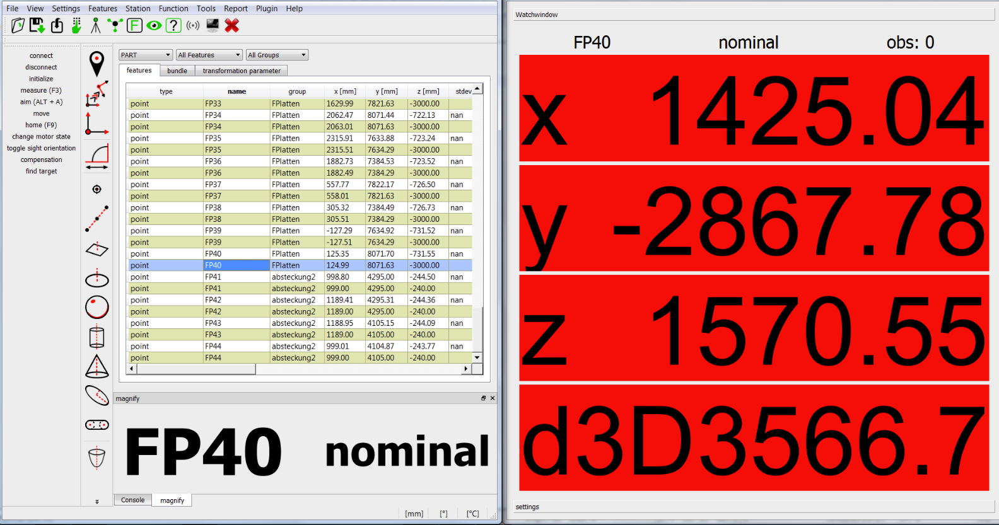

Here is an example to mark up a layout with OpenIndy and a Leica Lasertracker AT402.
Purpose of this task is to define your coordinate system for the production line, import the nominal points and mark their positions on the ground for later build up.

To define the coordinate system, you may get the level information of your lasertracker first and then define the coordinate axis (e.g. in pillars of the factory).

Workflow:
 * import nominal points of the layout
 * create geometries that define the coordinate system (level plane, points/ planes to define other coordinate axis (x or y axis on pillars)).
 * measure system defining geometries
 * solve transformation parameters from Station to "PART"
 * select first point of layout and press "alt + a" to aim
 * open watch window with F4
 * when point is in tolerance, measure with F3 and select next point in the list to aim

For additional information read the [user guide](http://openindy.github.io/documentation/docu-usr/measurement/#common-measurement-example)

In general the setup looks like this:

<figure>
	
 

	
<i>overview of a layout</i>

</figure>

After you defined your system just import the points and mark them on the ground using the "watch window" and "aim" command of the software.

<figure>
	
 

	
<i>layout with OpenIndy</i>

</figure>
